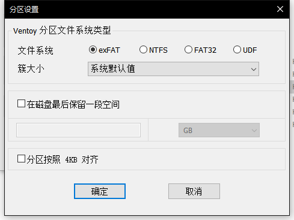
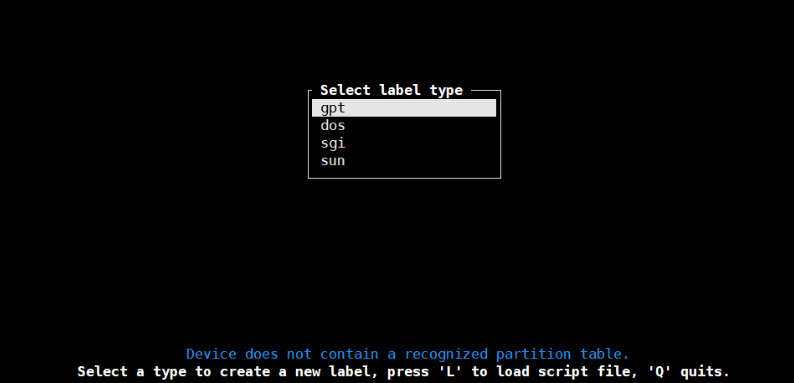

---
tags:
- Unix
- Linux
- Arch Linux
- Sway
categories:
- 系统安装
title: "安装 Arch Linux + Sway"
date: 2023-02-11T20:26:10+08:00
draft: false
showTOC: true
---

:source-highlighter: pygments

== 环境
惠普笔记本，CPU 为 AMD 5700U，无独显。系统装在希捷的移动硬盘（非固态）上。

== 准备工作
1. 从 https://archlinux.org/download/ 下载 ISO 镜像。
2. 准备一个已经格式化的 U 盘。
3. 下载 https://github.com/ventoy/Ventoy[Ventoy]。

== 制作启动盘
在确保已插入 u 盘的情况下打开 Ventoy。
将分区类型设置为 GPT，并根据下图设置其他选项：

然后点击安装，等待完成。
完成后直接将镜像复制到 u 盘即可。

制作完成后 u 盘不影响正常使用，所以制作前仅需备份好资料。
== 从 U 盘启动
关机并按电源键重启，启动过程中需不停按 F12 来进入 BIOS。
部分笔记本可能按键不同。
经测试惠普的笔记本为 F10。

然后转到启动选项，在启动顺序中将「从 UEFI 启动改为 U 盘」移至顶部。
然后关闭安全模式。
某些主板需要删除安全金钥才可以关闭。

保存，电脑会自动重启。等待片刻后进入 Ventoy。
选择下载的镜像后将会弹出安装选项，选择第一个。

部分电脑需要指定启动引导。如这次所用的笔记本需要在退出 bios 后连续按 F8 并指定从 U 盘启动才可以顺利进入。

== 安装最基本的系统
=== 联网
输入 ~iwctl~ ，进入 =iwd= 的交互式提示符。然后输入以下命令：

[,bash]
----
device list # 列出网卡名称，一般为 wlan0.
station <device> scan # 扫描当前环境下的网络
station <device> connet <network name>
passwd: # 输入密码
exit
----

测试链接
[,bash]
----
ping baidu.com
----

更新系统时间
[,bash]
----
timedatectl set-ntp true
----
=== 设置 ssh 连接（非必须）
使用另一台电脑 ssh 连接后可以方面地粘贴代码，复制错误日志。
所以初次安装推荐使用 ssh 进行后续步骤。

为当前环境设置密码
[,bash]
----
passwd
----
然后输入 ~ip a~ 查看 ip 地址。

在另一台主机上输入以下代码即可：
[,bash]
----
ssh root@<ip>
----
=== 设置安装源
==== 禁用 reflector
[,bash]
----
systemctl stop reflector
systemctl disable reflector
----
==== 修改安装源
[,bash]
----
nano /etc/pacman.d/mirrorlist
----
建议只保留 tuna、nju、ustc 几个源。
=== 系统分区
首先查看目前硬盘的状态：
[,bash]
----
lsblk
----
由于我计划使用的是移动硬盘安装，在 ~lsblk~ 中被识别为 sdb。
所以输入
[,bash]
----
cfdisk /dev/sdb
----

由于我未格式化移动硬盘，分区表类型已这设置为 dos。
所以需要删除原有的空间。
但删除后发现仍无法重新定义分区格式，
只好尝试接着往下做，
好在实际使用中暂时没有发现问题。

若选择的安装介质为空盘，正常情况下应该会进入类似的界面

选择 GPT ，然后按照下列表格划分区域：

[cols="1,1,1"]
|===
|Device|Size|Size Type

|/dev/sdb1|500M|EFI System

|/dev/sdb2|5G|Linux Swap

|/dev/sdb3|<剩余空间>|Linux filesystem 
|=== 

记得划分好后选择 Write 保存。

然后输入
[,bash]
----
lsblk
----
检查是否有效。
=== 格式化分区并挂载
[.bash]
----
mkfs.vfat /dev/sda1
mkfs.ext4 /dev/sda3
mkswap /dev/sda2

# 挂载

mount /dev/sda3 /mnt
mkdir -p /mnt/boot/efi
mount /dev/sda1 /mnt/boot/efi
swapon /dev/sda2
----
检查
[,bash]
----
lsblk -f
----
=== 安装最基本的系统
[,bash]
----
pacstrap /mnt linux linux-firmware linux-headers base base-devel vi git bash-completion nano
----
=== 生成文件系统表
[,bash]
----
genfstab -U /mnt >> /mnt/etc/fstab
----
=== 进入新系统
[,bash]
----
arch-chroot /mnt
----
=== 设置时区
[,bash]
----
ln -sf /usr/share/zoneinfo/Asia/Shanghai /etc/localtime
hwclock --systohc
----
=== 本地化设置
设置系统语言
[,bash]
----
nano /etc/locale.gen
# 取消注释下面两行
en_US.UTF-8 UTF-8
zh_CN.UTF-8 UTF-8
----
生成本地语言信息
[,bash]
----
locale-gen
----
设置语言环境变量
[,bash]
----
echo "LANG=en_US.UTF-8" > /etc/locale.conf
----
=== 网络设置
设置主机名
[,bash]
----
echo arch > /etc/hostname
----
生成 hosts 文件
[,bash]
----
nano /etc/hosts
# 在文件末尾添加
127.0.0.1   localhost
::1         localhost
127.0.1.1   arch.localdomain arch
----
=== 配置 Grub
==== 安装相关软件包
[,bash]
----
pacman -S grub efibootmgr efivar networkmanager amd-ucode openssh
----

若 CPU 为 Intel，则将 amd-ucode 替换为 intel-ucode。
==== 生成 grub 配置文件
[,bash]
----
grub-install /dev/sda
grub-mkconfig -o /boot/grub/grub.cfg
----
==== 配置 NetWork
[,bash]
----
systemctl enable NetworkManager
----
==== 重新配置 root 密码
[,bash]
----
passwd
----
==== 启动 sshd 服务
[,bash]
----
systemctl enable sshd
----
==== 创建账户
由于安全原因，不推荐直接修改 ssh 配置允许重启系统后可以直接使用 root 账户登录。所以在此处创建账户 cl。
[,bash]
----
useradd --create-home cl # 创建
passwd cl # 设置密码
usermod -aG wheel,users,storage,power,lp,adm,optical cl # 设置用户组
visudo
# 取消注释下列行
%wheel ALL=(ALL) ALL
----

vi 中，h j k l 分别对应了方向键的 ← ↓ ↑ →。
输入 i 即可进入编辑模式，按 ESC 回到普通模式。
按 / 即可进入查找模式。
若需保存退出则在一般模式下输入 :wq。

==== 重启系统
[,bash]
----
exit
umount /mnt/boot/efi
umount /mnt
reboot
----

这时候可以拔出启动盘了，等待重启完成。
== 安装图形界面（非必须）
理论上重启后已经是一个完整的 linux 系统。
但由于我此次安装的目的是为了日常使用，需要图形界面。
所以还要继续以下步骤：
=== 重新使用 ssh 连接
[,bash]
----
ssh cl@<ip>
----
=== 添加 Archlinuxcn 软件源
[,bash]
----
sudo nano /etc/pacman.conf
# 在最后输入
[archlinuxcn]
Server = https://mirrors.tuna.tsinghua.edu.cn/archlinuxcn/$arch
----
然后输入：
[,bash]
----
sudo pacman -Syy
sudo pacman -S archlinuxcn-keyring
----
=== 安装显卡驱动
[,bash]
----
sudo pacman -S xf86-video-amdgpu vulkan-radeon mesa
----
其他显卡可以参考 https://wiki.archlinux.org/title/Xorg#Driver_installation[Xorg] 以及 https://wiki.archlinux.org/title/Vulkan#Installation[Vulkan]。
=== 配置声卡
[,bash]
----
sudo pacman -S alsa-utils pipewire pipewire-audio pipewire-alsa wireplumber
----
=== 安装显示服务
[,bash]
----
sudo pacman -S wayland xorg-xwayland
----
若你是 NVIDIA 用户，请考虑禁用显卡改用 intel 核显或根据官方 wiki https://wiki.archlinux.org/title/NVIDIA[NVIDIA] 进行配置。
=== 安装字体
==== 英文字体
[,bash]
----
sudo pacman -S ttf-dejavu ttf-droid ttf-hack ttf-font-awesome otf-font-awesome ttf-lato ttf-liberation ttf-linux-libertine ttf-opensans ttf-roboto ttf-ubuntu-font-family
----
==== 中文字体
[,bash]
----
sudo pacman -S ttf-hannom noto-fonts noto-fonts-extra noto-fonts-emoji noto-fonts-cjk adobe-source-code-pro-fonts adobe-source-sans-fonts adobe-source-serif-fonts adobe-source-han-sans-cn-fonts adobe-source-han-sans-hk-fonts adobe-source-han-sans-tw-fonts adobe-source-han-serif-cn-fonts wqy-zenhei wqy-microhei
----
==== 打开字体引擎
[,bash]
----
sudo vim /etc/profile.d/freetype2.sh
# 取消注释最后一句
export FREETYPE_PROPERTIES="truetype:interpreter-version=40"
----
=== 安装桌面环境
我这里采用的是平铺式桌面 https://swaywm.org/[Sway]。
[,bash]
----
sudo pacman -S sway wofi kitty swaylock swaybg swayidle greetd greetd-tuigreet-git clipman ark paru
sudo nano /etc/greetd/config.toml
# 在最后一行加入
[default_session]
command = "tuigreet --cmd sway"
# 退出
systemctl enable greetd
----

再次重启，完成安装。
